# TTS Cloud Sandbox — Architecture Diagrams (SSP)

All diagrams required by the Supplementary Service Broker (SSB) System Security Plan,
following FedRAMP SSP template sections 9–10 and the C4 model. Diagrams are cross-referenced
to SSP sections and NIST SP 800-53 Rev 5 control families where applicable.

| Diagram                                                                    | SSP Section    | Controls           |
| -------------------------------------------------------------------------- | -------------- | ------------------ |
| [1. System Context](#1-system-context-diagram-c4-l1)                       | 9.2, 9.5       | SA-9, SC-7         |
| [2. Authorization Boundary](#2-authorization-boundary-diagram)             | 9.2, 9.5       | SC-7, CA-3         |
| [3. Network Architecture](#3-network-architecture-diagram--ssp-figure-9-1) | 9.5 Fig 9-1    | SC-7, SC-8, SC-22  |
| [4. Container Architecture](#4-container-diagram-c4-l2)                    | 9.2, 10        | CM-7, CM-8         |
| [5. CSB Component Architecture](#5-csb-component-diagram-c4-l3)            | 9.2, 10        | CM-7, SA-4, SC-2   |
| [6. Deployment Architecture](#6-deployment-diagram-c4-deployment)          | 10, 10.9       | CM-8, SA-9         |
| [7. Data Flow](#7-data-flow-diagram--ssp-figure-10-1)                      | 10.4 Fig 10-1  | SC-8, AU-2, AC-3   |
| [8. Authentication Flow](#8-authentication-flow--ssp-section-94)           | 9.4            | IA-2, AC-17        |
| [9. TTL Lifecycle](#9-ttl-sandbox-lifecycle-sequence)                      | custom         | CP-10, CM-8        |
| [10. CI/CD Pipeline](#10-cicd-pipeline--ssp-sections-1073--1079)           | 10.7.3, 10.7.9 | CM-3, SA-10, SA-11 |
| [11. RBAC & Access Control](#11-rbac--access-control)                      | 9.4, 10        | AC-2, AC-3, AC-6   |
| [12. Logging & Monitoring Data Flow](#12-logging--monitoring-data-flow)    | 10.8.10        | AU-2, AU-12, SI-4  |

---

## 1. System Context Diagram (C4 L1)

> **SSP Reference:** Section 9.2 General System Description, Section 9.5 Network Architecture  
> **Controls:** SA-9 (External Information System Services), SC-7 (Boundary Protection)

The TTS Cloud Sandbox SSB manages the full lifecycle of multi-cloud sandbox service instances
on behalf of GSA TTS engineers. It inherits FedRAMP Moderate P-ATO controls from cloud.gov
(FR1920000001) and brokers to three external CSPs.

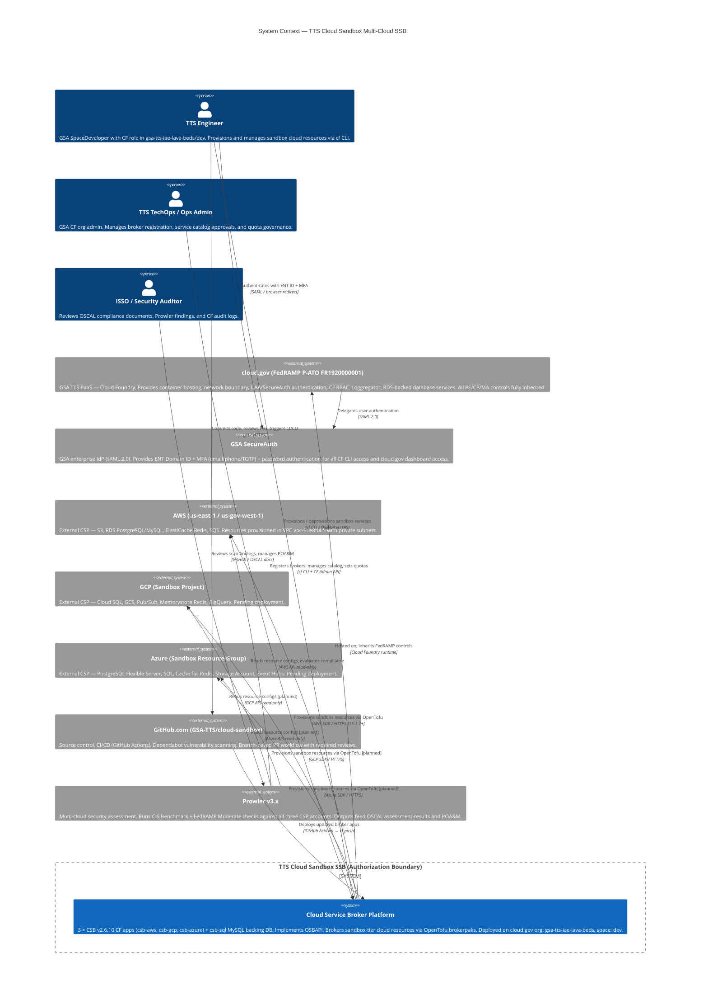

---

## 2. Authorization Boundary Diagram

> **SSP Reference:** Section 9.2 Information System Components and Boundaries  
> **Controls:** SC-7 (Boundary Protection), CA-3 (System Interconnections), CA-9 (Internal Connections)

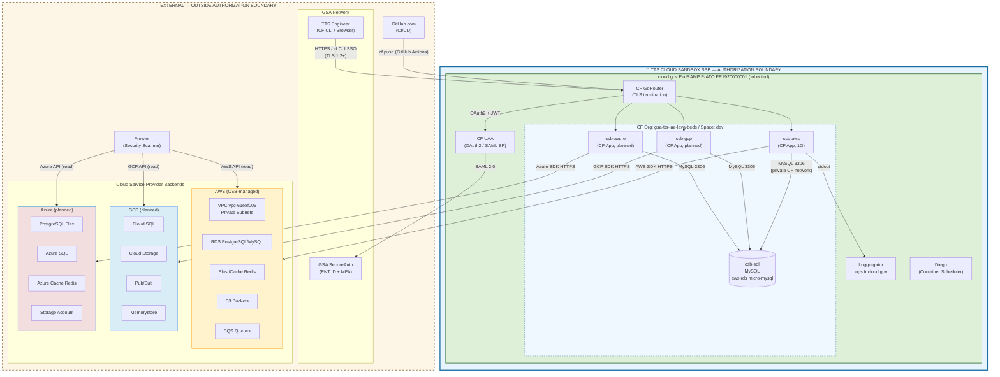

---

## 3. Network Architecture Diagram — SSP Figure 9-1

> **SSP Reference:** Section 9.5 Network Architecture (Figure 9-1)  
> **Controls:** SC-7 (Boundary Protection), SC-8 (Transmission Confidentiality), SC-22 (DNS Architecture)

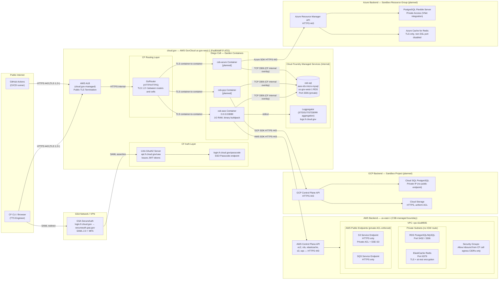

---

## 4. Container Diagram (C4 L2)

> **SSP Reference:** Section 9.2 System Assets, Section 10 System Environment  
> **Controls:** CM-7 (Least Functionality), CM-8 (Component Inventory)

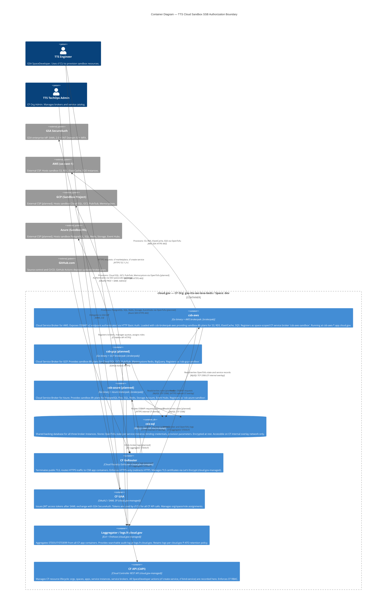

---

## 5. CSB Component Diagram (C4 L3)

> **SSP Reference:** Section 9.2 (API service written in Go and Terraform), 10.7.2 (IAC Implementation)  
> **Controls:** CM-7, SA-4, SC-2 (Application Partitioning)

Internals of the Cloud Service Broker application — all three broker instances (csb-aws, csb-gcp, csb-azure)
share the same architecture; only the loaded brokerpak differs.

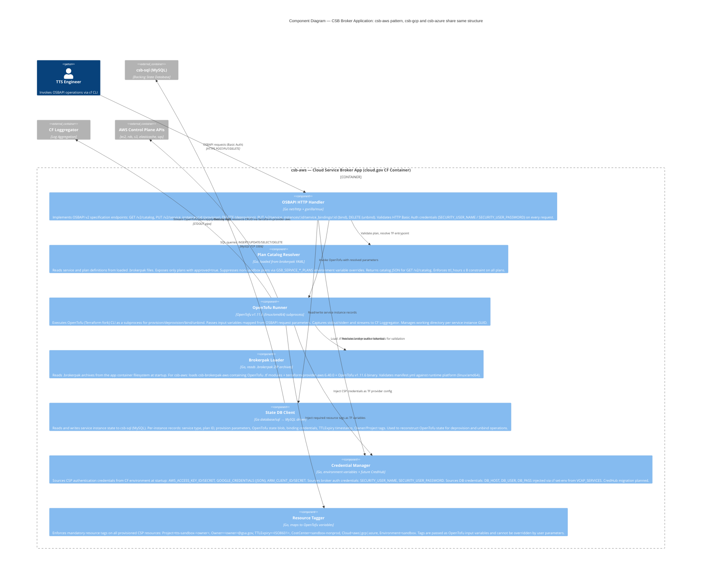

---

## 6. Deployment Diagram (C4 Deployment)

> **SSP Reference:** Section 10 System Environment, Section 10.9 AWS Services, Section 9.1 System Locations  
> **Controls:** CM-8 (Component Inventory), SA-9 (External Information System Services)

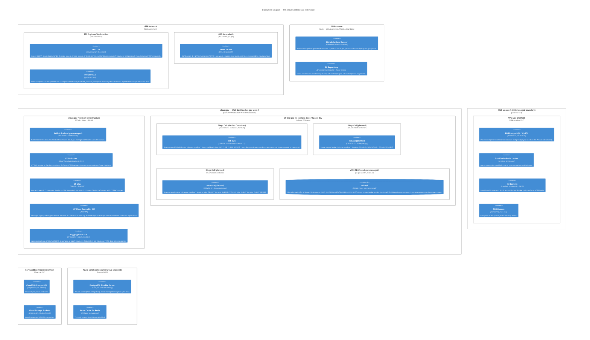

---

## 7. Data Flow Diagram — SSP Figure 10-1

> **SSP Reference:** Section 10.4 Data Flow (Figure 10-1)  
> **Controls:** SC-8 (Transmission Confidentiality), AU-2 (Audit Events), AC-3 (Access Enforcement)

This diagram documents all data exchanges between actors, boundary components, and service back-ends.
The broker does not act as a gateway between client and the provisioned service instance: it only
sets up the instance and returns credentials.

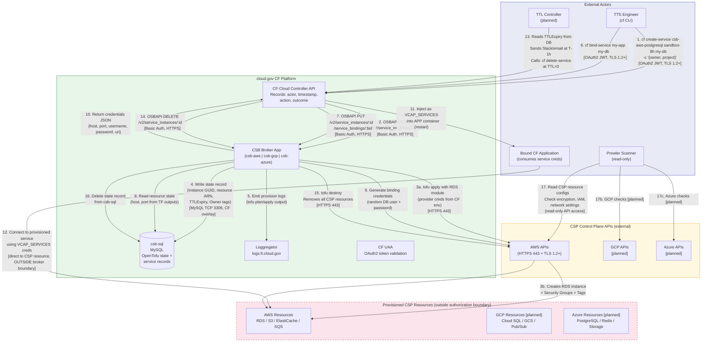

---

## 8. Authentication Flow — SSP Section 9.4

> **SSP Reference:** Section 9.4 Types of Users (Privileged User Access workflow)  
> **Controls:** IA-2 (Identification and Authentication), AC-17 (Remote Access), AC-3 (Access Enforcement)

### 8a. CF CLI Authentication (SSP Section 9.4)

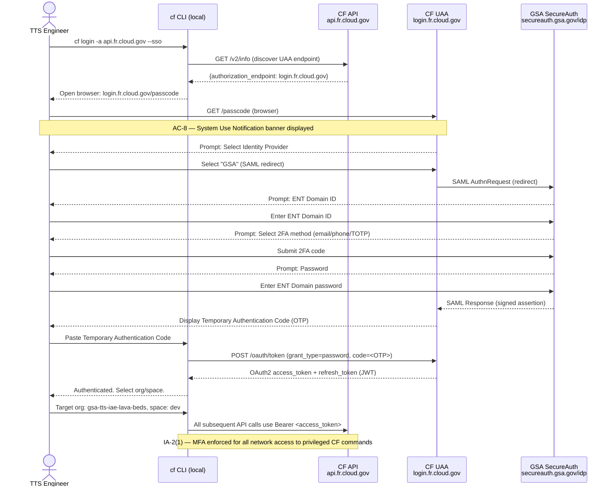

### 8b. CF RBAC Authorization for Service Broker Operations

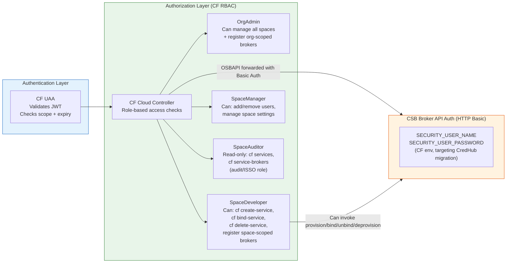

---

## 9. TTL Sandbox Lifecycle Sequence

> **SSP Reference:** Custom governance — TTL policy (8h default, one 4h renewal)  
> **Controls:** CP-10 (Recovery & Reconstitution), CM-8 (Component Inventory), SI-7 (Software Integrity)

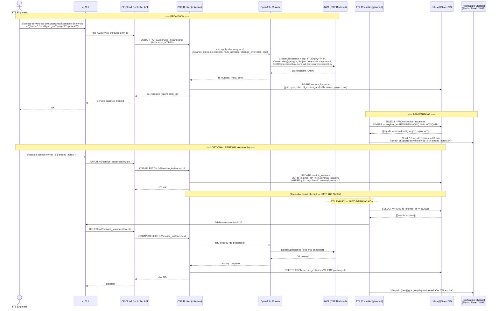

---

## 10. CI/CD Pipeline — SSP Sections 10.7.3 & 10.7.9

> **SSP Reference:** Section 10.7.3 Pipeline Design, 10.7.9 Code Change and Release Management  
> **Controls:** CM-3 (Configuration Change Control), SA-10 (Developer Configuration Management), SA-11 (Security Testing)

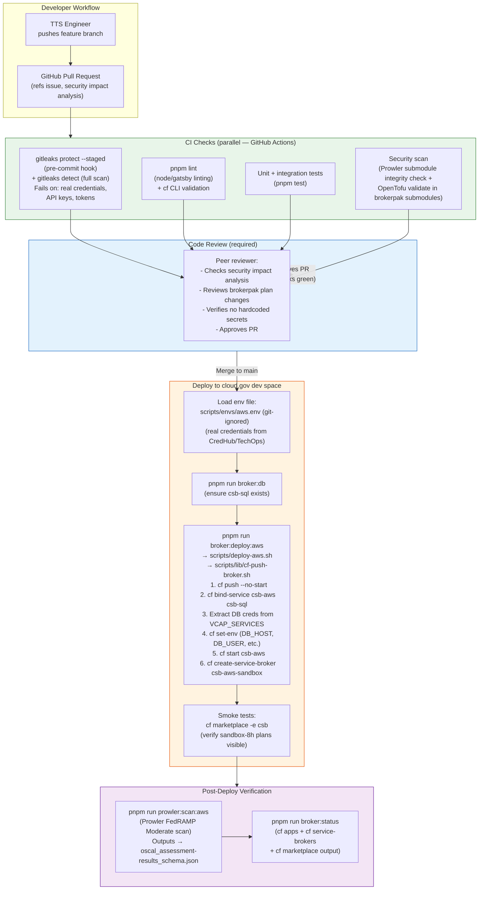

---

## 11. RBAC & Access Control

> **SSP Reference:** Section 9.4 Types of Users, Section 10.8.7 Privilege Management  
> **Controls:** AC-2 (Account Management), AC-3 (Access Enforcement), AC-6 (Least Privilege)

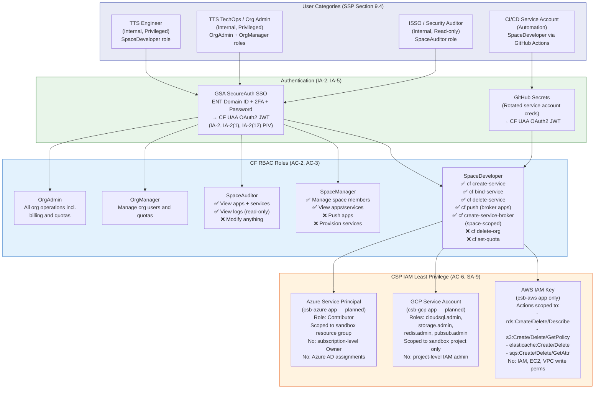

---

## 12. Logging & Monitoring Data Flow

> **SSP Reference:** Section 10.8.5 Logs and Log Integration, Section 10.8.10 Monitoring and Alerting  
> **Controls:** AU-2 (Audit Events), AU-12 (Audit Generation), SI-4 (Information System Monitoring)

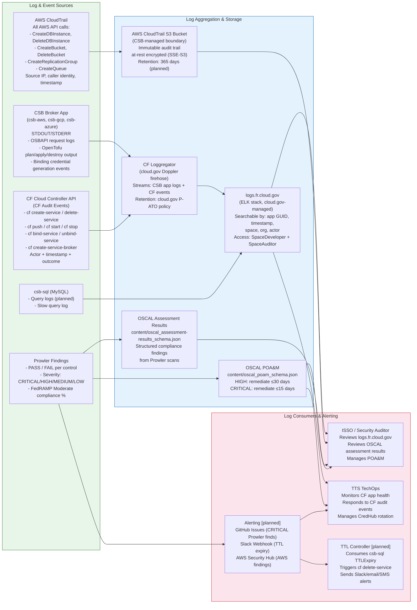

---

## Appendix: Component Summary Table

> **SSP Reference:** Table 9-2 System Assets, Table 10-1 Asset Physical and Virtual Components

| Component                | Type                        | Hosts                                  | Status            | Key Controls                 |
| ------------------------ | --------------------------- | -------------------------------------- | ----------------- | ---------------------------- |
| `csb-aws`                | CF App (Go binary)          | cloud.gov dev space                    | ✅ Running        | AC-2, AC-3, AU-2, CM-7, IA-2 |
| `csb-gcp`                | CF App (Go binary)          | cloud.gov dev space                    | ⏳ Pending        | SA-9, SC-7, SC-28            |
| `csb-azure`              | CF App (Go binary)          | cloud.gov dev space                    | ⏳ Pending        | SA-9, SC-7, SC-28            |
| `csb-sql`                | MySQL (aws-rds micro-mysql) | cloud.gov (AWS GovCloud)               | ✅ Running        | SC-28, AU-12                 |
| csb-brokerpak-aws v0.1.0 | Brokerpak (.brokerpak ZIP)  | loaded into csb-aws                    | ✅ Active         | SA-9, SC-7, SC-13, SI-2      |
| csb-brokerpak-gcp        | Brokerpak (.brokerpak ZIP)  | loaded into csb-gcp                    | ⏳ Pending        | SA-9, SC-7, SC-28            |
| csb-brokerpak-azure      | Brokerpak (.brokerpak ZIP)  | loaded into csb-azure                  | ⏳ Pending        | SA-9, SC-7, SC-28            |
| `cloud.gov`              | PaaS (FedRAMP P-ATO)        | AWS GovCloud us-gov-west-1             | ✅ Inherited      | AC-2, AU-8, IA-2, SC-7, SC-8 |
| GSA SecureAuth           | IdP (SAML 2.0)              | GSA enterprise                         | ✅ Inherited      | IA-2, IA-2(1), IA-2(12)      |
| `Prowler v3.x`           | Security scanner            | Developer workstation / GitHub Actions | ⏳ Config pending | CA-2, CA-7, RA-5, SI-4       |
| TTL Controller           | Lifecycle enforcer          | TBD (CF app / GH Actions)              | 🔲 Planned        | CP-10, CM-8, SI-7            |
| `logs.fr.cloud.gov`      | ELK log aggregation         | cloud.gov (inherited)                  | ✅ Inherited      | AU-2, AU-12, AU-9            |
| GitHub.com CI/CD         | SaaS (GitHub Actions)       | GitHub.com                             | ✅ Active         | CM-3, SA-10, SA-11           |
| OpenTofu v1.11.6         | IaC runtime                 | embedded in brokerpak                  | ✅ Active         | CM-3, SA-4, SA-10            |

---

_Generated: 2026-04-14 | System: TTS Cloud Sandbox SSB v0.1.0-draft | OSCAL version: 1.0.4_  
_Cross-reference: [oscal_component_schema.json](../content/oscal_component_schema.json) | [oscal_ssp_schema.json](../content/oscal_ssp_schema.json)_
